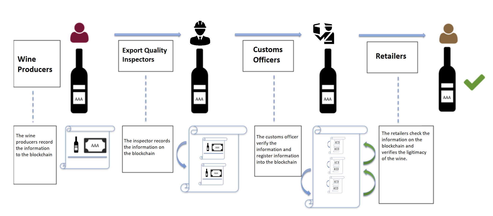

# Project Three - Blockchain

 Group Name: "WineChain - Stop counterfeit wine and spirits distribution"

 Group members:
* Shanshan Zhang
* Sreeni Kalva
* Cuong Phan

---

# Project Outline 

One of the most common question whenever we consume any wine product is "Where does the wine come from ?" Traditional approach is often inefficiencies and rigidity, which makes it difficult for users to track the original source of wine. Further challenges include wine counterfeit or illegal production that are negatively impact the industry: It is estimated that 20% of all wine currently circulating the globe is fake (which is in line with all luxury goods) and it’s not just rare wines that are impacted, some ‘commercial’, household labels and wines are now also being counterfeited. These biggest challenges that are facing wine supply chain today can be overcomed by the implementation of Blockchain technology.

Our group, WineChain, main objective is to provide an innovative solution using Blockchain to tackle this issue. Our main idea is to connect these following stakeholders directly, include:

* Wine Producers
* Export Quality Inspectors
* Customs Officers
* Retailers 
* Consumers (End Users)

Using the main feature of Blockchain, which are traceability, security, and decentralisation when dealing with data around the wine supply chain. Transactions that have been carried out will be store to different nodes where all users are able to access and view it, which certainly cereate a  transparent environment that no parties are able to intervene it.

---

# Project Details

At the most stage of this supply chain, there will be a need to transfer data or accreditations. Therefore, this presents a tremendous opportunity for blockchain solutions to combine with other technologies - such as the Internet of Things (IoT) - to generate efficiencies and remove red tape.

The whole process of the wine supply chain is complex, including growing, producing and transporting the wine, with multiple stakeholders involved in the process. Therefore, the adaptation of Winechain technology will undoubtedly outweigh the traditional approach in the long term. Key segments of the supply chain are described below:

1. Wine Producers - The first user will store the information about the batch of wines to be exported on the Blockchain. They can also upload the pictures of the wine, which are processed to the Blockchain, to make an informed decision about the quality of the wine. The data could include the quality of soil composition and temperature and also the cultivation methodology.

2. Export Quality Inspectors - Assuming the batch of wines to be exported in Australia, the inspectors will examine the quality and then store the information related to the quality of the wine on the public Blockchain. Data stored on the Blockchain will help retailers and consumers later verify the quality and authenticity of the wine.

3. Customs Officers - As the batch of wines has been imported to China, the customs officer will verify the origination of this batch of wine and its quality and authenticity. Custom Officer will later register the information of the current location and transportation details on the Blockchain. 

4. Retailers -  the retailer can capture all the information to ensure the wine is authentic or not by backtracing the wine items from the Blockchain. This allows retailers to improvise their inventory-tracking system and also optimise their payment between members of the supply chain.

5. Consumers (End Users) - From source to destination, the consumer is allow the explore the story of the wine, from vineyard to glass. Winechain's objective is attained, as we would be able to reduce the wine counterfeit issue through transperency of provenance, as well as promote the originator of the product. 
 
 (To be edited later)

---

Further Developments:

* Issuing Token: (TBU)

* Payment System: a payment system that utilize WineChain token in order to incentivize the stakeholders. 

---

# Presentation

https://docs.google.com/presentation/d/1O9RXw_nOBEApSPTjTWBhRXDkZobvYPJuv-kPtP5XMUQ/edit?usp=sharing

---

# Development Environment

* Ganache
* Remix

---
# Other

